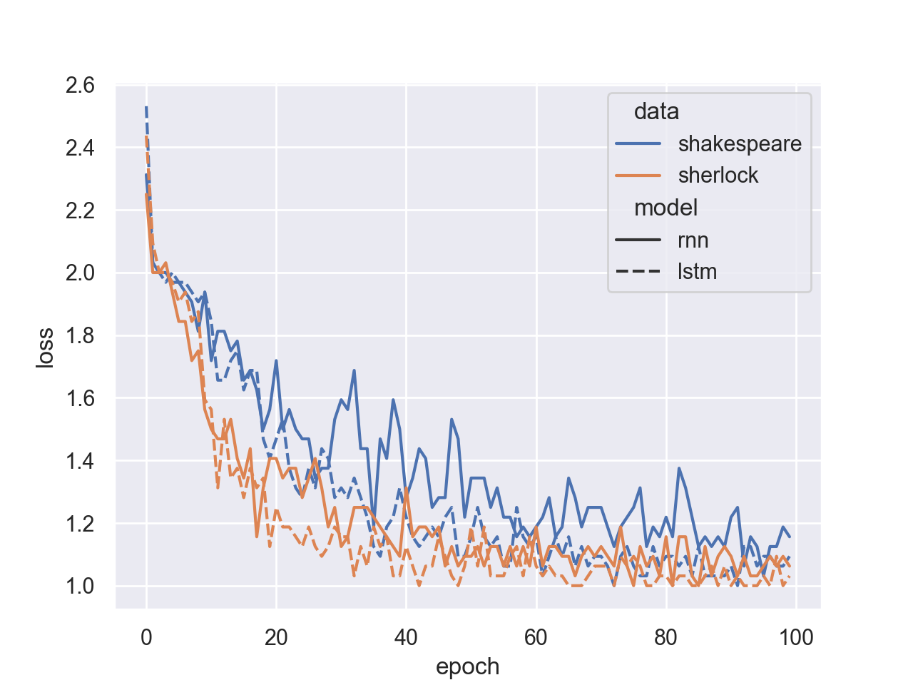
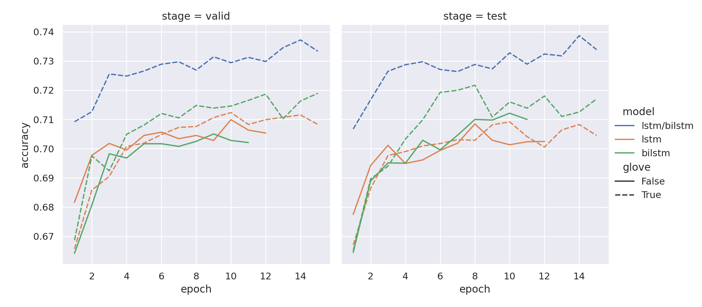

# Assignment 3 - RNNs

## Q1: Character RNN (CharRNN)

The original parameters were changed so that learning rate is 1e-3, number of epochs is 100 and the epoch sizec is 32.

## Q1.1: Training with sherlock.txt
Results from training the CharRNN on sherlock with varying temperature in the output:

### With seed character: e
```
------------/FOR TEMPERATURE = 0.1/------------
e that he was a little that the proming of the proming of the proming of the most that the most with the proming of the proming of the proming of the proming of the promist of the proming with a single

------------/FOR TEMPERATURE = 0.5/------------
en with a last to prector great on the proming him with up our proms with that he had a put our might out out and see say into the promisting of the prom the word with the prom the pronce.

------------/FOR TEMPERATURE = 0.9/------------
e objedge had greens in this fuot that anything only few with in shall smonting who asked himes with a goon him that the vetter we eldew with him supher. This
 orson, he doing of pasions chill reged it
```

### With seed character: p
```
------------/FOR TEMPERATURE = 0.1/------------
penting of the proming of the proming of the proming of the proming of the proming of the proming of the proming of the promise of the promist of the proming of the promise of the proming of the promin

------------/FOR TEMPERATURE = 0.5/------------
penty from the mosimes were in that he were course of the word and a service of and the most in the pount of the was have that and me it is the most to dear did us with the to put it. Holmes which with

------------/FOR TEMPERATURE = 0.9/------------
penising me that him withou intere only tell risins ob the sine man sensure that he with eyes pross flus. Frem feet dog guidy for,
 we mosts of an you space with the burnir. Gants for mikion older, and
```

### With seed character: 2
```
------------/FOR TEMPERATURE = 0.1/------------
2 our man which with a man which was a man which was a little with the promise with a single was a little that the proming of the proming of the promise of the promise of the proming with a little that

------------/FOR TEMPERATURE = 0.5/------------
2. The that he table which we with a should be this proom appeorous and you will are to proving which in the ground with the put the most out out out again him sight which with and the confet that he w

------------/FOR TEMPERATURE = 0.9/------------
2 know--for serictions and the says with that a purst up alones or apperton face was agail rememilink a little for which
 lastly down stall a can take in that be wonders lad, ruman remone or. Have cain
```


## Q1.2: Training with shakespeare.txt
Results from training the CharRNN on shakespeare with varying temperature in the output:

### With seed character: b
```
------------/FOR TEMPERATURE = 0.1/------------
but the shall the for the present the for the father for the present the prince the for the fines for the for the shall the for the prince the faints for the shall the shall the shall he she please the

------------/FOR TEMPERATURE = 0.5/------------
ble of the holl so feed fall the bear fell heart
Which furst the prase the she bear her friend yet finest the bear belicome should neven it forth of you friends fither,
If it me the father, as I beart 

------------/FOR TEMPERATURE = 0.9/------------
beteng!
The stands, the feash hatar,
You all to most quent
In this prether soo:
To puttoneft:
I well hour lion me bestronts of my coplets Call ham's marry:
That Henus mo the king me be rives evenged to
```

### With seed character: M
```
------------/FOR TEMPERATURE = 0.1/------------
My for the shall the shall the shall the bear the for the for the for the for the shall her for the shall the proved for the bear the shall the father for the for the shall the shall the for the bear t

------------/FOR TEMPERATURE = 0.5/------------
MIDIUS:
Whose the fents for the cames,
The should yet the present the rich thought his not What such me for the father fall that I proved me me purst for the shall in the plaing you the batters me the 

------------/FOR TEMPERATURE = 0.9/------------
My lirgalieven should and me; the lords, hath of cherm.

AUMIUS:
If I but the pleasoneds measure that inselfing Luch thus hers it that be pression justres bray.

AULEN OF SYRUCHESTO:
The forges, Lay de
```

### With seed character: \n
```
------------/FOR TEMPERATURE = 0.1/------------
\n
The prince the should the forth the for the father for the for the shall the fain the for the father for the prince the for the father for the for the shall the bear the for the father for the for the

------------/FOR TEMPERATURE = 0.5/------------
\n
There me forth it,
The forth the formed shall she it the friends in the present and I am my letter her for the gains me poor many for the plear in the will heart stir the should the sounds for his ton

------------/FOR TEMPERATURE = 0.9/------------
\n
And I nevers; and no lost the's most thus it 'elpens in than your'd welcost---
I rabe her never
denight: If thus I know: her for this lenent sponed the hophous shorsed all to but ufeeptions, boldam, I
```

## Q2: Character LSTM (CharLSTM)

The original parameters were changed so that learning rate is 1e-3, number of epochs is 100 and the epoch sizec is 32.

## Q2.1: Training with sherlock.txt
Results from training the CharLSTM on sherlock with varying temperature in the output:

### With seed character: w
```
------------/FOR TEMPERATURE = 0.1/------------
way the stranger of the strange of the stranger of the strange of the stranger of the strange of the possible of the strange of the possible the possible the stranger of the stranger of the stranger of

------------/FOR TEMPERATURE = 0.5/------------
way through and street to you have been me to his all the paths of the scept of the flowed and into the police on the room with a remarked and Streed the strade in the like a back and been a pertain me

------------/FOR TEMPERATURE = 0.9/------------
wiles of but in himposted
 the hearies over. There wards place something to the extrade, I don's rememwhing. Then I had seems a caut by my could that no could with the soving on the seems in a clear at
```

### With seed character: £
```
------------/FOR TEMPERATURE = 0.1/------------
£ing the possible of the stranger and seems of the stranger of the seems of the stranger in the stranger of the some the possible of the strange of the stranger of the strangers of the strange of the s

------------/FOR TEMPERATURE = 0.5/------------
£e see to be a come of the could not be and a strong me to be some the furch one out in the strand out by the possible cleed and could nothing to have a place the wound to read there in a sice, and the

------------/FOR TEMPERATURE = 0.9/------------
£om compano one. I are largst sat our track not his possible of the
 thougure of the trundabled, and I could I dan't they was morawal belock close?-"He buse, and I centlemoned to sabticilatory, up to l
```

### With seed character: s

```
------------/FOR TEMPERATURE = 0.1/------------
s the strange of the stranger of the stranger of the strange of the strange of the strange of the possible the strange of the stranger of the strange of the possible of the possible of the strange in t

------------/FOR TEMPERATURE = 0.5/------------
s man was a groves of the
 street was the post come to terrist that she was a room
 in the back to his
 peried in the reman in the strugg one of the rest and interestion that the seemed and police the 

------------/FOR TEMPERATURE = 0.9/------------
stems aftertain in evening this?"

 He wall drubm In her dust to arrson out out into them out and greed as Ind nothing to way come to conscee!" and I suspers in onewarcy. In the cappowed in the smottin
Seed character: s
```

## Q2.2: Training with shakespeare.txt
Results from training the CharLSTM on shakespeare with varying temperature in the output:

### With seed character: z

```
------------/FOR TEMPERATURE = 0.1/------------
zends and the parent the beard the word the man the man and the beard the beard the beard the porter the porter the more the beard the man as a man and the word and the word the word and the word and t

------------/FOR TEMPERATURE = 0.5/------------
zen the mortant are and they have the like of the see the cross about a full heart
That is the like the are and the portain the fareing,
And his shall and not by hath at the beast that were the fair of

------------/FOR TEMPERATURE = 0.9/------------
zon in the ambertime person
That cannot a saying assed beat me,
For the timelition them sen: Gender,
My come, thought to to hands, and hath stack the heart,
Then slain of ebberly, that us master
Princh
```

### With seed character: B

```
------------/FOR TEMPERATURE = 0.1/------------
Be the fair the man and the beard the parter and the word and the word the parent the word the beard the parter the porter the parest the porter the pains of the beard the beard the word the beard the 

------------/FOR TEMPERATURE = 0.5/------------
Bith the confing;
Be heart with the least me toon the fastiens.

FALSTAFF:
Why, the reat a cast son protess of the word is the pains the art
To more the porries,
And be the means and fair of thee, and 

------------/FOR TEMPERATURE = 0.9/------------
BEjRY:
Who heir such then the prays, then
Butius rongmanners and my like the with one and, greats boase.

HAROCHAM:
God bging have be stard, call man
abone mind me trought have mistertavoked my dugue:
```

### With seed character: t

```
------------/FOR TEMPERATURE = 0.1/------------
the word the more to be the shall the word and the word the pains and the porter the man assured the porter the parent the man and the beard the beard the beard the word the beard the portain the beard

------------/FOR TEMPERATURE = 0.5/------------
these the isselves to have and the like to many ben the word.

ROSALIND:
Why, then the like as as faith a cancest the earter, my beart of the many
That no be anger at faster the art and a more the poor

------------/FOR TEMPERATURE = 0.9/------------
ter:
To gatch a noll'd is fail the kint plevery,
As Prince is a passion and the
gliked chansiness and thy pin his should the long and to beful well men faccitions;
Barwer, by the true, the marks of as 
```


You will notice in all the results that, as the temperature increases, the vocabulary used gets more and more wild, and the sentences become more complex. Here are some examples of the top K and top P values produced after the final round of LSTM training on the sherlock corpus:

```
Top K = t, o,  , e, i

Top P = :, ?, a, 8, A, ;, L, t, u, g, o, !, ,, n, ", B, V, d, -, k, w, j, v, p, x, 
, l,  , I, F, r, T, ., M, E, e, q, C, h, m, ', i, G, f, c, y, H, s, b
```

Even though the top k was set to 5 and the top P was set to 0.5, the number of values produced is much different. It isn't clear why this may be. What is clear is that the top P in this case produces values that are capital and other specical characters, while the top K produces values that are much more likely to be seen. The final results training curve can be seen below:



You can see that the LSTM trains faster than the RNN (in terms of number of epochs, in terms of clock time, the LSTM was much slower to train than the RNN). It also achieved a better loss for both corpus after 100 epochs. I would say that the strength of the LSTM is that it is a stronger model for this task, but it is much slower and complex than the RNN.

## Q3: ShallowBiLSTM vs unidirectional LSTM

The number of epochs was modified from 32 to 320 as training was taking too long and 32 wasn't using enough of the GPU memory to be efficient. All models were trained with 2 layers. See below the results from all five models, for validation set on the left and testing set on the right. The dotted lines show models trained with the glove dataset, and solid lines without. The blue line shows the true LSTM model from pytorch, adapted for bidirectionality, the orange line shows the true unilayer LSTM and green shows the shallow bidirectional LSTM. All the bi-directional models seem to use more memory and take more training time than the unidirectional. 



The final results from the test set (all compared at the tenth epoch) are as follows:

#### Ranked Accuracy
1. BILSTM - 72.89 %
2. Shallow BILSTM with glove - 71.39 %
3. Shallow BILSTM - 70.99 %
4. LSTM with glove - 70.40 %
5. LSTM - 70.23 %

The results show that the real bidirectional LSTM is the best model, and that the models trained with glove are significantly better than those without. 
