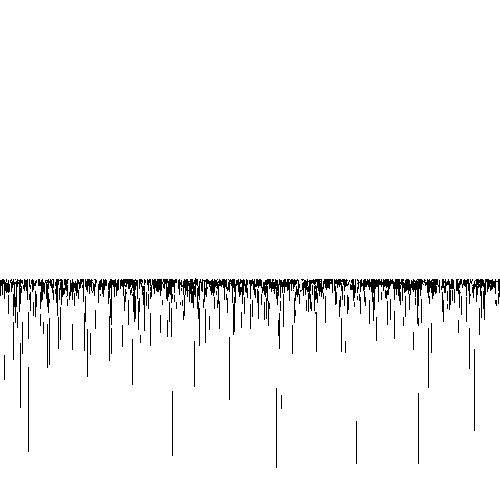
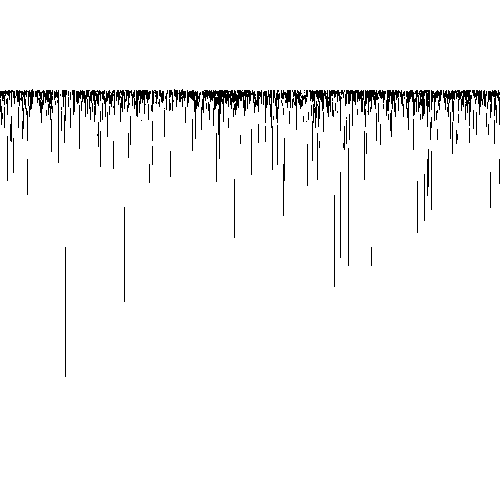
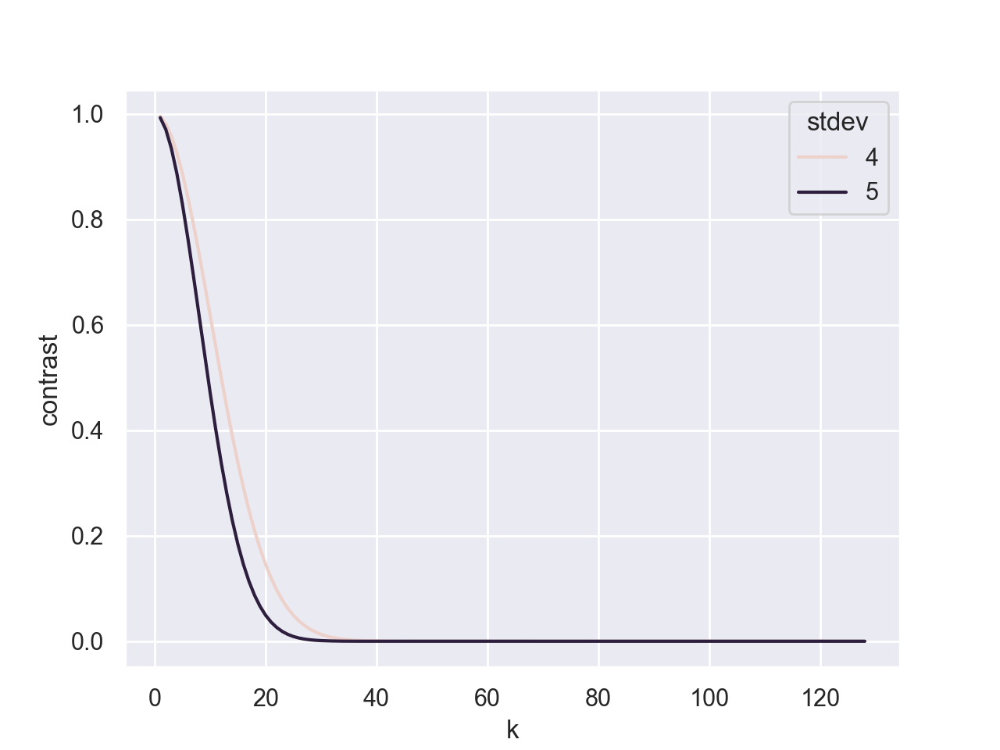
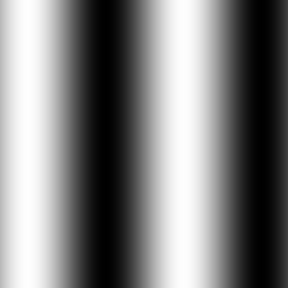
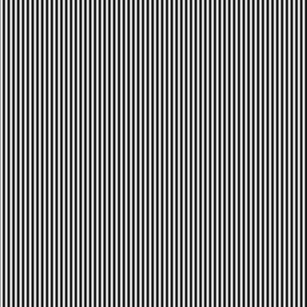
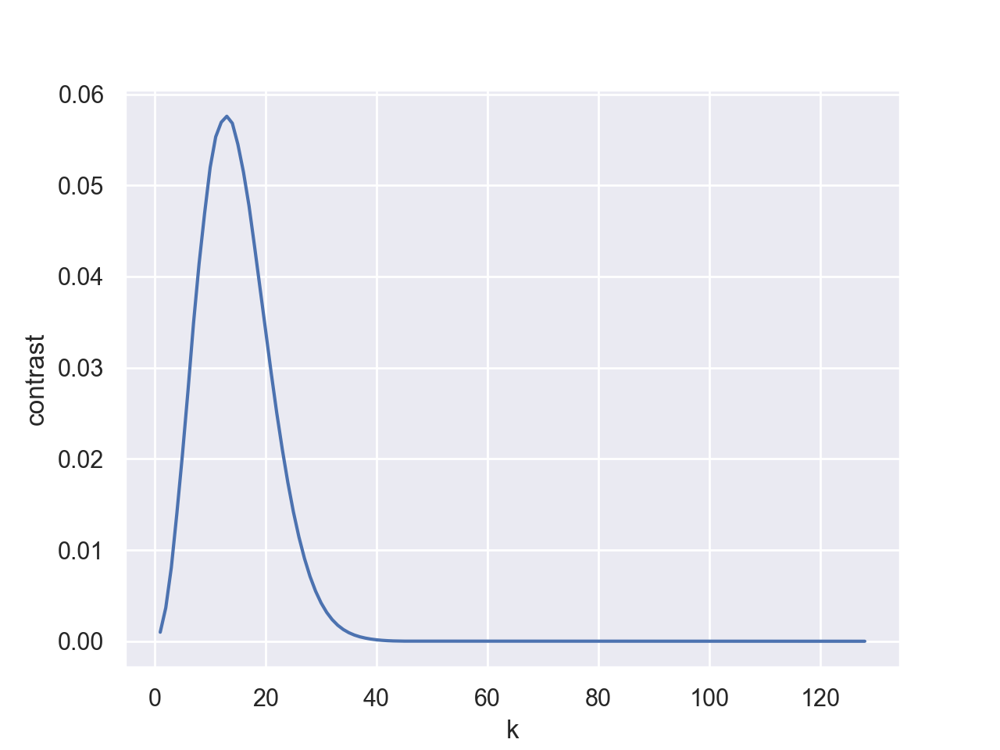
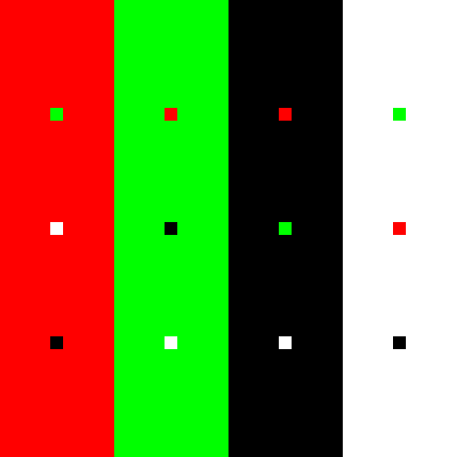
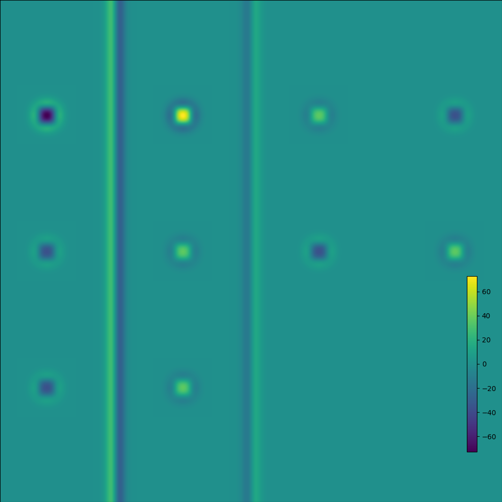

# COMP546 A1

## Question 1: Visual direction and visual angle

I selected the following parameters for the scene. All the parameters are described in numpy dimensions, AKA pixels.

__FIELD_WIDTH/LENGTH = 100,000__
 - This was selected as this size in order to have the width and depth of the scene equivalent. The scene also needs be very wide in order for the poles to appear all accross the horizon. 

__DISTANCE = 100__
- Maximum distance of the poles away from the viewer, selected so that we have the same cluster of poles on the horizon as in the sample.

___MAX_HEIGHT = 500__
- The maximum height of a pole. Selected so that poles don't appear signficantly taller than in the sample.

__VIEWER_HEIGHT = 1000__ 
- The viewer is selected so that even if a pole is directly in front of the viewer, you can always see above it, i.e. the pole is never taller than our viewer. Also selected so that the horizon is at a similar location to what it is in the sample. 

### Sample 1: A taller viewer 
Below is the sample with the default viewer height of 1000 and a pole height of 500

### Sample 2: A shorter viewer with taller poles
Below is the sample with the shorter viewer height of 600 and a pole height of 600

## Question 2: DOG filtering of 2d spatial frequencies

### Part (a): Michelson contrast plot 
See below the plot of michelson contrast as a function of varying k for the gaussian with standard deviation 4 and 5.

To understand why the contrast is highest, see below the plot of the original image with k=1

versus after gaussian blurring with standard deviation of 5

Compare this to the original image when k=32 

versus after gaussian blurring with standard deviation of 5

Any variance in the pixel intensity is removed, meaning that the contrast is reduced to near nothing after filtering. The drop-off in this contrast is more marked in the larger gaussian filter, because it will affect lower variances faster, as it is a larger filter. 

### Part (b): Root mean squared contrast 

Below shows the root mean squared contrast plotted as a function of k for the difference of gaussian filter applied to the cosine image.

Note that the peak occurs at a k of 13, which corresponds to image below:

This corresponds to a wavelength of 256/13 ~ 20. This wavelength corresponds to exactly half the size of our DOG filter, which is sized to be 8 times the standard deviation of the largest filter, 40. See below the filter. Note that the distance from trough to peak is almost exactly 20, which would work perfectly for improving the contrast of an image with wavelength 20.

## Question 3: Double opponent cells

Below see the original RGB image and the results of the double opponent cell re-mapped in viridis. See below that the highest value is observed when the small red square is on a green background, and the lowest when a small green square is on a red background. This agrees with expectations as we are working with a red-excitatory, green-inhibatory DOG, so that we are promoting any square with a green surrounding and demoting any square with a red surrounding. With other backgrounds, we are promoting a red square and demoting a green, which can be seen on the right. 

