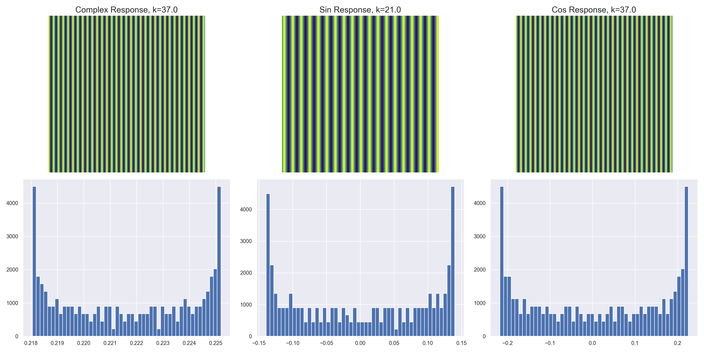

# A2 COMP546

## Question 1

### part a

Bar image:

Orientation curve:

The maximum is located at 90 degrees, and the minimum is located at 0 degrees and would also be located at 180 degrees. This is because we are dealing with a vertically oriented complex cell, which is sensitive to bars that are vertically oriented.

### part b

Bar image:

Orientation curve:

The maximum is located at 90 degrees, and the minimum is located at 0 degrees and would also be located at 180 degrees. This is because we are dealing with a vertically oriented complex cell, which is sensitive to edges that are vertically oriented. This is a result of the sin part of the complex cell.

## Question 2

### part a

See below the plot of complex cell response as a function of k. The maximum response happens at a k~37. To to visualize why this is the case, a horizontal slice of the image, cos and sin gabor was taken to see how the peaks and troughs of the image and complex cell align. While the sin technically peaks at a k of 21, this is the highest complex response, and it is clear that the peaks in the cell align nicely with the peaks of the image.

See below the 2x3 plot of complex, sin and cos response. Note that the range plotted in the images at the top is not always 0-255, but is scaled to the range of the x-axis in the histogram. You can see that the sinusoidal pattern of the original image is amplified by the cell, and the range is equal in magnitude in both positive and negative direction for cos and sin response, however there is slightly more positive response than negative, leading to a greater-than-zero response.

### part b

See below the 2x3 plot for a random noise image. The cell response can be seen plotted in the title of each subplot. The range of values for all of the complex, sin and cos response are normally distributed, very different from the heavy-tailed distributions of part a. The range of values is also much smaller. The complex cell response of just greater than 180 is approximately the value observed for a k>60 in part a.

## Question 3

See below the 1x2 results of the binocular disparity-tuned complex cells. All of the curves are quadratic, with varying width. The cell angle with the highest response is zero and then decreases the most at ninety degrees, with 135 and 45 degrees equal and somewhere between those two extremes. The minimum in the unshifted image is observed at a binocular shift of zero, while it is observed at -2 in the right image. This is observed for all four curves, however they all seem to keep the same shape and order despite the image shift.

