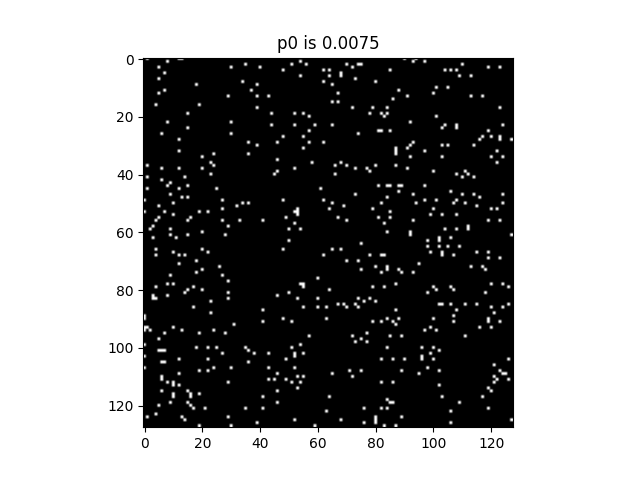

# A3 COMP546

## Question 1

### part a

See below the results for the 2d image velocities. The y-axis represents the velocity in the y-dimensison and the x-axis in the x-dimension. The minimum of zero is observed at an x-velocity of 2 and a y-velocity of 0. This is in agreement with expectations as discussed in lecture 10, as the respose is smallest when the motion constraint line passes through the real image velocity, which in this case is equal to the normal velocity. The maximum of the plot occurs when the gabor filter is perfectly out of phase from the image velocity, in this case +/- 4 from the motion constraint of (0,2) -> (0,-2) and (0,6). 

### part b

See below the results for the varying angle of the normal cell. While the orientation of streaks in the plot changes depending upon the angle, the magnitude and location of the minimum (0, and (0,2), respectively) does not change from part (a). The maximum in each case is directly perpindicular (tangential to the normal) and the same distance of ~4 units away from the minimum. The range is the same as in part (a). As discussed in part a, the minimum is observed when the motion constraint line passes through the image velocity (0,2) and the normal velocity.

### 45 degrees:

### 90 degrees:

### 135 degrees:

### part c

See below the plot of mean response over all four angled gabor filters. As the minimum in each angle was 0 at (0,2), the minimum of this plot is the same location and magnitude. What is different is that the plot forms a circle around the minimum, with a maximum being observed in each direction ~4 units in distance. This shows that the complex cell has a maximum response in any direction exactly 4 units out of phase of the filter, which is an improvement over prior results which showed a maximum only directly perpendicular to the normal.

### part d

See below the plot of mean response for a velocity of (0,6) as opposed to (0,2). Note that the minimum is now located at (0,6) instead of (0,2) and that the radius of the 'circle' in the response is the same as before. This demonstrates that the motion constraint line has simply been shifted through space, from the small velocity to the large, without warping or stretching any other components of the gabor or the response.

## Question 2

### How does Q2 function work?

The function works by first splitting the image into two parts upon two different axes - top/bottom and left/right. A complex cell oriented vertically k=(4,0) and oriented horizontally k=(0,4) are then convoluted with each of the four two image halves. Each response is combined with the response from the associated perpendicular image half. For example, the horizontal cell response for the left half is combined with the vertical cell response for the right half, the vertical response for the top half is combined with the horizontal response for the bottom half etc. If the maximum is observed in the top/bottom split, then 'tb' is returned, otherwise 'lr' is returned.

See below the plot for displacement=2. The image noise was maintained at 0.02 and the range of p0 used was `[0.0005,0.001,0.0015,0.0025,0.0045,0.0075,0.01,0.012,0.015,0.025,0.035,0.05,0.06,0.08,0.1]`. In order to get the sigmoid to fit properly, 30 trials were used. Just below that plot are sample glass images for displacement=2, the top is the left/right arrangement and the bottom is top/bottom. The psychometric threshold of 0.75 demonstrates at what probability (or really, density) of dots our gabor detection system is able to detect the glass pattern. It can be verified with the sample image that the human eye is able to differentiate which image represents the top/bottom and which the left/right, because our gabor system is activated for the image.

For displacement=1, the same p0 range from above was used, however the noise was decreased to 0.005. See below the response curve, and two samples, lr and tb, from the glass images used in the experiment. Many trials were performed prior to determining that a proper curve could only be generated for an image size of 256, so the results show for N=256. Note also that while a sigmoid was fit for an asymptote of 1, it appears closer to 0.9 in this case. As with above, we can verify with our own eye which half shows horizontal 'streakiness' which represents oriented structure. 

For displacement=4, the p0 range from above was used, without the 4 final values. The original p0 noise of 0.02 was used. See below the curve fit, as well as a left/right and top/bottom sample image as with the above cases. This case was much easier to fit than a displacement of 1 or 8. In this case, the orientation flow is harder to see than the above two samples, but it can become clear the more you look at it.

For displacement=8, the p0 range from displacement=4 was used. The p0 noise was decreased to 0.005. See below the unsuccessful curve fit. Despite changing the image size N to 256 and trying a myraid of things to get the curve to fit, it was not successful. See the response curve as well as two sample glass images below. Looking at the samples below, it is quite clear why our detector did not work, no matter the density of dot. There is not local orientation obvious to the eye, meaning that it would be hard for our artificial gabor filter to activate. 

## Question 3

See below the drawing for the disparity map as well as the accompanying re-drawing from above. The regions are indicated using the colors and symbols used in the re-drawing.

