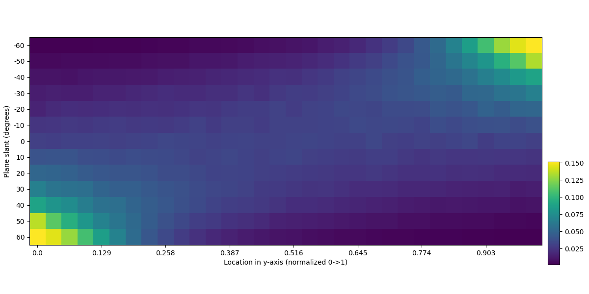
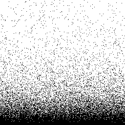
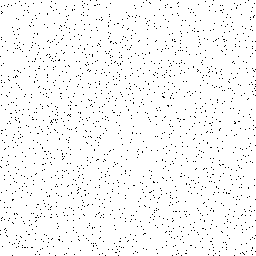
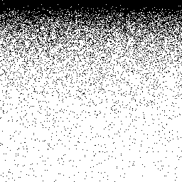
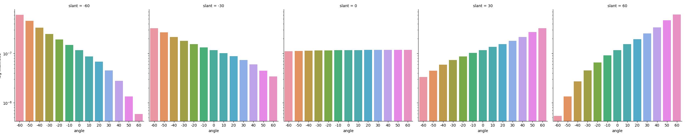

# Assignment 4

## Question 1, part a

See below the plot for conditional probability of a dot appearing in each y-slice for angles in [-60,60]. The y-axis shows the angle of rotation of the plane and the x-axis shows the location in the y-axis from 0->1, where 0 is the top of the image and 1 is the bottom. Note that the original image was 256 pixels wide, and was broken into 32 y-bins, each of 8 pixels width.

See below examples of slant at -60, 0 and 60 degrees. The concentration of points is near the bottom when the degree is negative and top when the degree is positive. This agrees with expectations as the tighter the dot density, the more the given side has been fore-shortened. If the high-density is at the bottom, it indicates that the plane has been titled upwards and the inverse for the top.

__Plane tilted to -60 degrees__

__Plane tilted to 0 degrees (not tilted)__

__Plane tilted to 60 degrees__

## Question 1, part b

See below the results for part b. The top plot shows the total dot counts in each y-bin, for all of the five angled images produced. The bottom shows the likelihood of each of the angles for each of the angled images produced (note that the likelihood was transformed back from log-likelihood for visualization). In the top plot, you can see the same concentration of points at the top (near 0) for positive angle 60 and at the bottom for negative angle -60. This is transformed into a probability of a single of the 2,000 dots being in one of the 32 y regions. The 60, -60 and 0 degree plots all agree with expecations, as the maximum likelihood is the true image angle. This is not the case with the -30 and 30 images, however, as the maximum is still at 60. This can be explained by observing the counts in the top histogram below and the image produced in part a. The pattern is not accentuated enough in the mild angles to have observable differences, resulting in inaccurate max-likelihood results.

