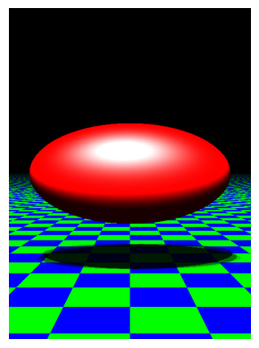
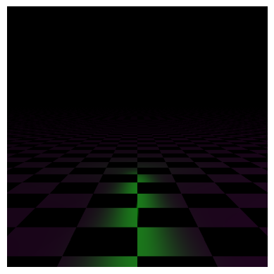

# COMP557 Assignment 4


## Unique Scene 

Please see the unique scene at the very bottom of this assignment.

## Ellipse with area lighting (1 mark area lighting, 0.5 marks quadric)

The ellipse is produced using the formula for a quadric and the area lighting is produced using a grid of point lights with random sampling. To produce these results, you may run:

```python
python3 main.py --infile scenes/EllipsoidAreaLight.json --outfile results/ellipse.png
```

See below for the output of this:



## Mirror (0.5 marks, mirror)

To demonstrate the mirror, a few point lights of different color are shone onto a 'mirror plane' to show they take on the color of that plane. All we needed to do to convert our regular material into a mirror was to turn the hardness up to 10000 and get rid of diffuse reflection! For an example of this, see the mirror output below:

```
python3 main.py --infile scenes/MirrorPlane.json --outfile results/green_mirror.png
```



## Parallelization (2 marks)

In order to 'parallelize' the code, I chose numba just in time complitation. This required a bunch of changes, including moving all glm to numpy, marking the types of all variables in the numba scope and changing the circular dependencies inside the Hierarchy into a 'flattened-tree'. This code can be found in the `provided_numba` folder. Here is how the list of objects was passed into the render function for rendering. To run an example, try the following. See below a code snippet of numba and the stack of boxes produced by the numba code.

```
python3 main.py --infile scenes/BoxStacks.json --outfile results/numba_boxstacks.png --numba
```


Example of class holding all the different objects, used instead of a list, as numba doesn't allow mixed types in a list.
```python
@nb.experimental.jitclass([
    ('spheres', nb.types.ListType(Sphere.class_type.instance_type)),
    ...
    ('sphereTransforms', nb.types.ListType(nb.float64[:,:,:])),
    ...
})
class ObjectContainer:
    def __init__(self, spheres, ...,
                 sphereTransforms, ...):
        self.spheres = spheres
        self.planes = planes
```

## Depth of field/Focus Blur (1 marks)

To implement this, a series of images were taken from a camera position slightly rotated around the lookat point. This works like an aperature, collecting light from slightly different positions in the projection plane, creating the effect of depth blur. To run this sample, you may run:

```
python3 main.py --infile scenes/TwoSpheresDepth.json --outfile results/depth_spheres.png --numba
```


## Textured mapped surfaces (1 mark)

For my unique scene, I wanted to use a custom mesh downloaded from the internet with a texture map. I also implemented a few of my added features in this unique scene to make it as interesting as possible. In order to produce the results shown below I followed the following steps:

1. Downloaded free mesh from sketchfab (https://sketchfab.com/tags/gudetama)
2. Simplified this mesh in Blender
3. Exported the mesh into simplified form

See below the results of my texture-mapped surface, which is also my novel scene. This is gudetama, the lazy egg, surrounded by eggs. The texture is loaded from `textures/gudetama-diffuse.png`