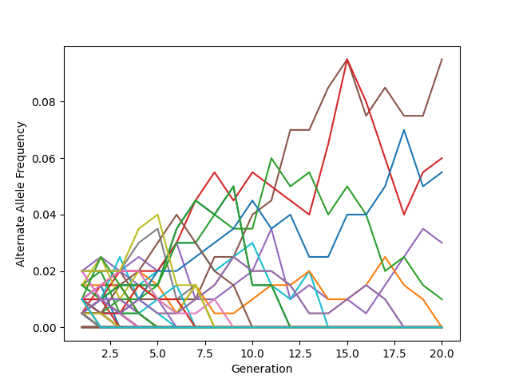
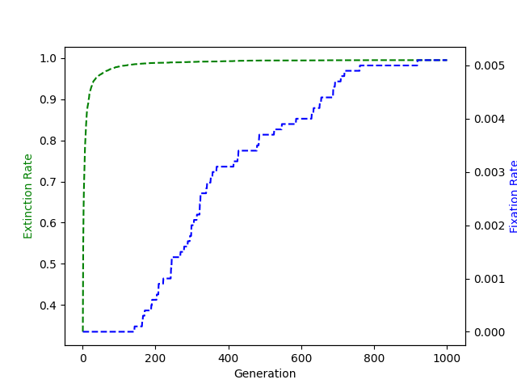
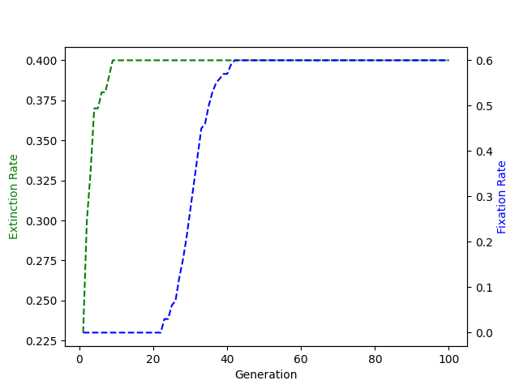
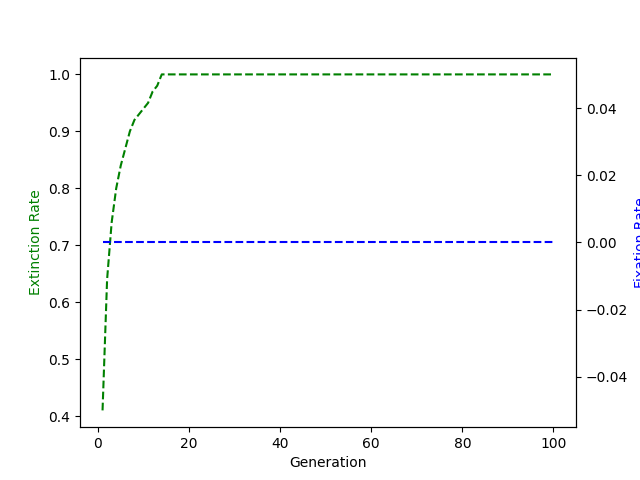
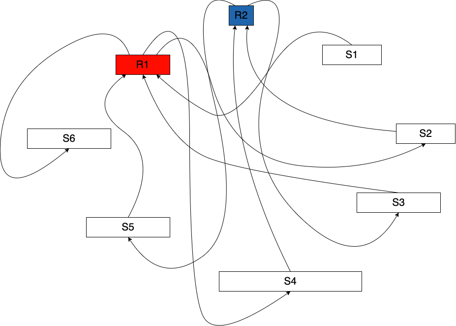

## Question 1.a

For code, see question_1 and associated utils imported from utils.popSimulation.

## Question 1.b

The probability that the first parent does not contain a given allele can be written as $P( x_1 \neq A)$. The second probability is the conditional probability $P(x_2 \neq A | x_1 \neq A )$, the probabilites of these, respectively are $(2N-1)/2N$ and $(2N-2)/2N$, and we run this 100 times, so the probability that NONE of the children contain allele $A$ can be written as follows:

$(P( x_1 \neq A) * P(x_2 \neq A | x_1 \neq A ))^N = ((2N-1)/(2N) * (2N-2)/(2N-1))^N = ((2N-2)/2N)^N$

This is the probability of extinction:

$((2N-2)/2N)^N$  = 0.366  when N=100

## Question 1.c

The analytical value is very close to the number we get through experimentation, which ranges from 0.39 to 0.34.

## Question 1.d



## Question 1.e



## Question 1.f

The probability that the SNP42 is extinct after one generation can be calculated as follows:

$(P( x_1 \neq SNP42 ) * P(x_2 \neq SNP42 | x_1 \neq SNP42))^N = ((2N-1.5)/(2N+0.5) * (2N-2.5)/(2N-0.5))^N$

This is the probability of survival, so the probability of extinction is:

$((199/200.5)*(198/199.5))^100$ = 0.221

This is confirmed by simulation, where it survives in approximately 0.21-0.23 of cases.

## Question 1.g



## Question 1.h



# Question 2.b

A total of 446 SNPs have p_value lower than 0.05. We would expect 500 SNPs to be significant by chance, 0.05*10000.

# Question 2.a

For code, see question_2.py and associated utils in utils.gwasRunner.

# Question 2.c

See results/snp_table_results.csv

```
SNP ID,Uncorrected p-value,Correct p-value,Disease odds ratio for heterozygous individuals,Disease odds ratio for homozygous alternate individuals
SNP1000,1.7324820411067143e-16,1.7324820411067143e-12,1.5828460038986354,2.5099111414900888
SNP2000,9.230118981405191e-07,0.00923011898140519,1.5034938807737863,2.24862721171446
SNP3000,5.62921270697861e-10,5.62921270697861e-06,1.5876165280927184,2.027660120652034
SNP4000,4.770371767336931e-07,0.004770371767336931,1.34410198935276,1.9961757105943152

```

# Question 2.d

Mathematically, the chi-squared test checks each variable in our 2-D table of alle counts (0,1,2) and the class observed (disease, no disease). It then uses the calculated expected value (the expected number of counts assuming no correlation) and the observed values (actual allele counts) and the following formula to calculate chi-squared:

$$\chi^2 = \sum \frac {(O - E)^2}{E}$$

This is summarized over each of our three alleles. Meanwhile, we calculate the odds ratio as the number of effected individuals given that they have a certain allele. This test, however ignores the expected and observed likelihood of disease vs non-disease, and thus measures the effect size given a disease/non-disease exists, but doesn't help to know if a correlation between allele type and the disease exists.


## Question 3.a 



## Question 3.b
Original: S1-R1-S2-R2-S3-R1-S4-R2-S5-R1-S6

1. Switch S3\S5: 

    S1-R1-S2-R2-S5-R1-S4-R2-S3-R1-S6

2. Switch S2\S4:

    S1-R1-S4-R2-S3-R1-S2-R2-S5-R1-S6

3. Switch R2\R4 + R3\R5:

    S1-R1-S4-R2-S5-R1-S2-R2-S3-R1-S6

## Question 3.c 

Assuming our algorithm is producing reads of 100 base pairs and our sequence contains a 1000 bp short tandem repeat, we will have a lot of fragments that will contain exactly the same bases. Because the goal of our algorithm is to make the shortest path possible, these reads will overlap perfectly and collapse down to a total repeat region of closer to 100, instead of 1000. 

## Question 4.a 

See data/viterbi_config.yaml:

```
coding_bases:
  AAA: 0.028427703368643392
  AAC: 0.0195624104865669
  AAG: 0.02352996485784469
  AAT: 0.01697670006262792
  ACA: 0.013766389458360827
  ACC: 0.01555791739494712
  ACG: 0.012814377893183295
  ACT: 0.014145850858237587
  AGA: 0.014807389758907689
  AGC: 0.02095432863036262
  AGG: 0.009365644639436113
  AGT: 0.013888958848586506
  ATA: 0.009207815561611267
  ATC: 0.018832031243441277
  ATG: 0.021212899672756517
  ATT: 0.020707510817168446
  CAA: 0.024727115203473583
  CAC: 0.013796612047731542
  CAG: 0.016148936920418886
  CAT: 0.014246592822806638
  CCA: 0.016661041906978227
  CCC: 0.007273569841885486
  CCG: 0.013479274859339032
  CCT: 0.010638351458491792
  CGA: 0.016338667620357263
  CGC: 0.019362605590171614
  CGG: 0.013470879695624945
  CGT: 0.014673067139482287
  CTA: 0.009966738361364785
  CTC: 0.013032652149749573
  CTG: 0.01950028627508265
  CTT: 0.015734215832942957
  GAA: 0.021316999702811205
  GAC: 0.010331088466556186
  GAG: 0.01251383103221896
  GAT: 0.023177367981853013
  GCA: 0.02087373505870738
  GCC: 0.01669965966006303
  GCG: 0.02251918714666855
  GCT: 0.019968736410328737
  GGA: 0.010826403125687355
  GGC: 0.01812683749145792
  GGG: 0.00990293511713772
  GGT: 0.01745858245981655
  GTA: 0.011071541906138712
  GTC: 0.010962404777855574
  GTG: 0.020474125265916812
  GTT: 0.017643276061526474
  TAA: 0.0
  TAC: 0.013128357016090171
  TAG: 0.0
  TAT: 0.014456471915658827
  TCA: 0.019258505560116927
  TCC: 0.008888799340475938
  TCG: 0.015789623913455935
  TCT: 0.012990676331179134
  TGA: 0.0
  TGC: 0.02162426269474681
  TGG: 0.02437787639296754
  TGT: 0.01444136062097347
  TTA: 0.016424298290240957
  TTC: 0.014031676631725996
  TTG: 0.02419989892222888
  TTT: 0.023712979426811803
coding_len: 990.4515103338633
noncode_len: 1177.8412959912137
noncoding_bases:
  A: 0.26608120198671326
  C: 0.2432772656723154
  G: 0.22580470699802177
  T: 0.26483682534294956

```

## Question 4.b 

For code, see question_4.py and associated utils in utils.viterbiAlgorithm.

In order to run the program, first:

```bash 
python3 question_4.py

usage: Viterbi Gene Finding [-h] [--gff GFF] [--fasta FASTA] [--cfg CFG] [--out OUT]

Find Genes using HMMs

optional arguments:
  -h, --help     show this help message and exit
  --gff GFF
  --fasta FASTA
  --cfg CFG
  --out OUT
```

For the output of this, please see results/Vibrio_cholerae_viterbi_genes.csv.

## Question 4.c

For the genes predicted from this, please see results/Vibrio_vulnificus_viterbi_genes.csv.

## Question 4.d

Here are the calculated results, from results/Vibrio_vulnificus_results_compare.yaml.

```
annotated:
  match_end: 0.314
  match_start: 0.0
  matches_both: 0.361
viterbi:
  match_end: 0.266
  match_start: 0.0
  matches_both: 0.312
```


## Question 4.e

### Properties of annotated genes that risk being missed 

The predictor is well-tuned to maximize the probability according to the heuristics selected, meaning that it will likely avoid events that lower probability. This includes:

1. Transitions of inter-gene to start
2. Transitions of gene to stop
3. Lower probability codons from the other gene, Vibrio Cholerae

This means that genes and inter-codon regions of shorter length will be avoided. To illustrate this, the average length of genes that were missed by the viterbi algorithm was calculated to be ~330 bases, which is about 1/3 of the length of the average gene length in the gff file, which was ~920 bases. The codon probability is also telling, having an average probability (according to our codon probabilites in the config) of 0.0177, which is about ~3% less frequent. 

### Properties of genes predicted by viterbi that don't exist (in annotations)

As mentioned in the previous section, viterbi will theoretically tend to miss smaller genes +/ inter-gene regions if there are short genes interspersed by an inter-gene region, which can be entirely skipped over to create one large gene. In addition, because stop codons are all similary likely, the first stop codon may be skipped if it gives an opportunity to lengthen the gene. This is evidenced by the fact that the average gene length of viterbi genes that were partially unmatched by the annotations is ~1066, more than 15% greater than the average codon length ~920.